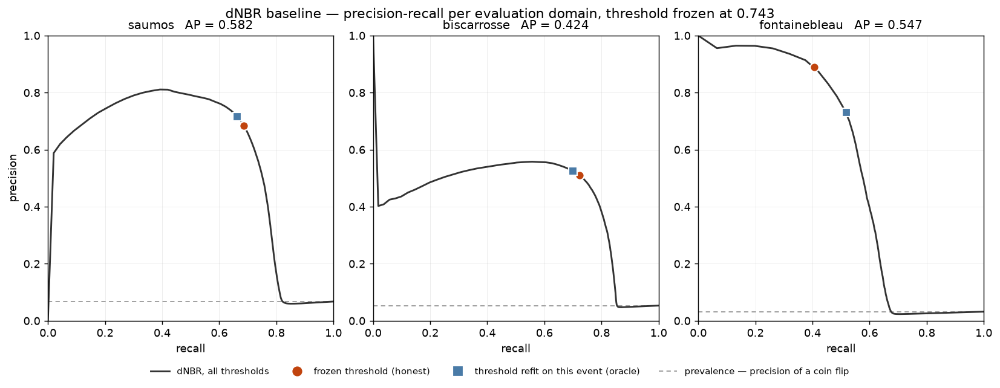

# burned-area-s2

Burned-area segmentation from Sentinel-2 pre/post pairs: a U-Net compared
against a thresholded dNBR baseline, on three Copernicus EMS fires from the
2026 French season.

The aim is to locate *where* a per-pixel index fails, and to see whether
spatial context fixes those specific failures. So both methods get a single
decision threshold, calibrated the same way on the same held-out pixels and
frozen before test, and the split is by event: train on Saumos (31 602 ha,
pine), test on Biscarrosse (1 753 ha, pine) and Fontainebleau (832 ha,
broadleaf). Comparing the two drops separates a size effect from a biome
effect.

**Status, 22 August 2026 — active development.** The data chain and the whole
evaluation machinery are built and have run; the baseline numbers below are
real. The U-Net does not exist yet, so nothing here compares anything to a
neural network.

## The baseline, and the hypothesis it is here to test

The dNBR is not a straw man. It is what an agency actually runs, and the
comparison is set up so it can win: one threshold, calibrated by maximising F1
on calibration blocks held out inside the training event, frozen, and applied
unchanged to every test event. The U-Net's threshold will come out of the same
function, on the same pixels. *Both methods have exactly one decision
parameter, calibrated by the same procedure on the same pixels and frozen
before test.*

| Exp. | Event | Method | IoU | F1 | Precision | Recall | AP | Area error |
|---|---|---|---|---|---|---|---|---|
| E1 | saumos | dNBR honest | 0.521 | 0.685 | 0.684 | 0.686 | 0.582 | +0.3% |
| E1 | saumos | dNBR oracle | 0.525 | 0.689 | 0.716 | 0.664 | 0.582 | −7.2% |
| E2 | biscarrosse | dNBR honest | 0.427 | 0.598 | 0.510 | 0.724 | 0.424 | +42.0% |
| E2 | biscarrosse | dNBR oracle | 0.429 | 0.600 | 0.525 | 0.701 | 0.424 | +33.5% |
| E2 | fontainebleau | dNBR honest | 0.388 | 0.559 | 0.890 | 0.407 | 0.547 | −54.2% |
| E2 | fontainebleau | dNBR oracle | 0.435 | 0.606 | 0.730 | 0.518 | 0.547 | −29.1% |

Full table, confusion matrices and provenance: [`outputs/baseline_results.md`](outputs/baseline_results.md).

**The oracle row is the instrument the whole comparison turns on.** It refits
the threshold on the test event itself — impossible in production, since it
needs the answer to produce the answer. It is the upper bound of what the index
can do at any threshold, so it splits any later "the network wins" in two: the
part a cheap local recalibration would also have bought, and the part that is
genuinely information a per-pixel index does not contain.

On these numbers the honest and oracle rows are nearly identical on the two
pine events (0.521 → 0.525, 0.427 → 0.429): the frozen threshold transfers
almost perfectly inside the biome it was calibrated in. On the broadleaf event
it is worth 4.7 IoU points (0.388 → 0.435), and the honest row's shape says why
— precision 0.89, recall 0.41, area under-predicted by 54%. The threshold
calibrated on pine is too severe for broadleaf: what it does find, it finds
correctly, and it misses most of the rest. **That 0.435 is the number the U-Net
has to beat to have demonstrated anything other than better calibration
transfer.**



The prediction written down here **before** the network exists, so that
checking it later means something: the Landes de Gascogne is a production pine
forest riddled with clearcuts whose NBR drop closely resembles a burn scar. A
per-pixel threshold cannot separate them; a network with a wide receptive field
should, because clearcuts are rectangular, aligned on the cadastre and
sharp-edged. That is the mechanism by which a CNN is expected to beat the
index, and Biscarrosse's precision of 0.51 — half of everything the index calls
burned there is not — is where it should show up.

## How the evaluation is set up


**Split by event, and by spatial block inside the training event.** Blocks are
~17.5 km, beyond the autocorrelation range of a scar this size. A 1 km buffer
between roles belongs to nobody, so no training pixel is within 2 km of a
calibration or test pixel.

**The test footprint is geometric** — EMS area of interest plus a 2 km buffer —
and every pixel inside it is scored, including entirely unburned ones. Nothing
is filtered for being negative; filtering would inflate precision by an
arbitrary factor and make the number comparable to nothing.

**One validity mask, both methods.** A pixel counts only if the Scene
Classification Layer calls it usable on both dates. The Saumos post-fire scene
is 27% clouded — it is still the best available, the alternative is 75% — and
that costs 8 293 ha of the scar. Those pixels are dropped for the index and
will be dropped for the network, identically.

**No confidence intervals are published, and that is a result.** The bootstrap
resamples spatial blocks, and it counts blocks that actually contain burned
pixels, because every metric here is a statement about burned area. Both
transfer events fit inside a single block. The training event has four held-out
blocks, but 94% of their burned area sits in one of them. So no evaluation
domain in this project supports an interval, every point estimate stands alone,
and each missing interval carries its reason in
[`outputs/baseline_results.json`](outputs/baseline_results.json). A declared
hole beats a false interval.

**The circularity floor is reported before anyone asks.** All three EMS
delineations are semi-automatic extractions, so part of any "learned method
beats the index" result is the index agreeing with how the label was drawn.
Threshold-free average precision of the raw dNBR against each label: 0.58, 0.42,
0.55.

**Never global accuracy.** It sits near 98% under this imbalance whatever the
method does; `config.yaml` forbids it and the metrics module refuses to emit
it.

## Running it

```bash
conda env create -f environment.yml
conda activate burned-area-s2

python -m src.config                              # events and settings, as loaded
python -m src.data.ems                            # EMS label provenance
python -m src.data.stac --event saumos --list     # candidate scenes + cloud
python -m src.data.stack                          # 8-channel stacks + validity masks
python -m src.eval.blocks                         # spatial blocks and their roles
python -m src.eval.dnbr                           # the baseline score rasters
python -m src.eval.baseline                       # calibrate, evaluate, write the table
python -m src.viz.quicklook --event saumos        # before / after / label
python -m src.viz.evaluation                      # PR curves and the split map
pytest -q
```

No credentials needed. The imagery is public COGs from the Element 84 STAC
catalogue.

## Layout

```
config.yaml     events, experiments, evaluation settings. No event name,
                EMS code or date lives anywhere else.
src/data/       STAC access, EMS labels, target grids, stacks and validity
src/model/      dataset, U-Net, training loop
src/eval/       dNBR, thresholds, metrics, blocks, bootstrap, the results table
src/viz/        figures
outputs/        versioned figures, tables and frozen thresholds, never rasters
tests/          guards on the evaluation setup
```

The tests exist because a leak produces a plausible number rather than a
crash, and that's the harder failure to catch: a test event can't appear in
training, the threshold can't be calibrated on a test event, test tiles can't
overlap, negative test tiles can't be filtered out, an interval can't be
published over a domain that cannot support one, and accuracy can't reach a
table.

## Data


False colour B12/B8A/B04 at 20 m — three of the four bands the model sees.
Scars read dark maroon.

Four bands × two dates = eight channels, at 20 m. The decisive argument for 20 m
rather than 10 m is not compute: the EMS polygons are digitised at 1:15 000, and
a per-pixel score at 10 m would mostly measure the analyst's hand.

## Licence

MIT. Copernicus EMS products and Sentinel-2 data under their respective terms.
