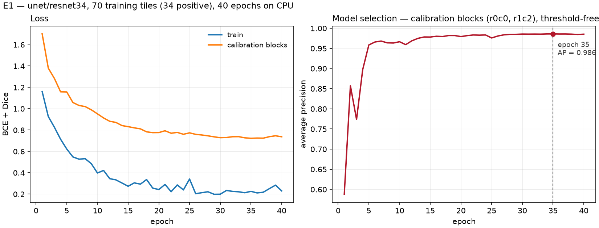
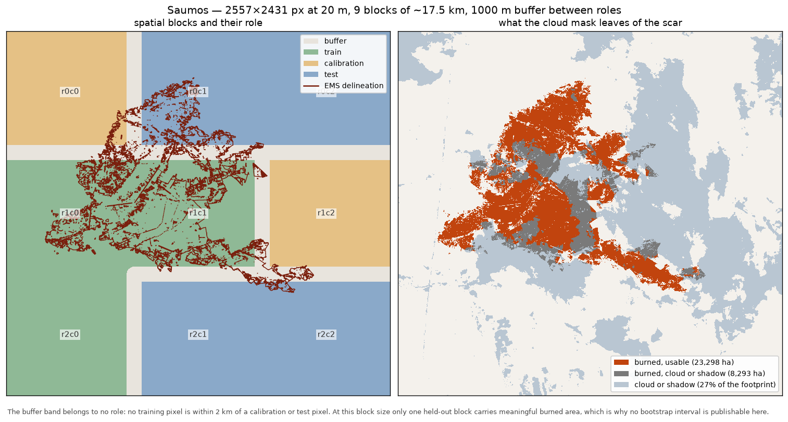
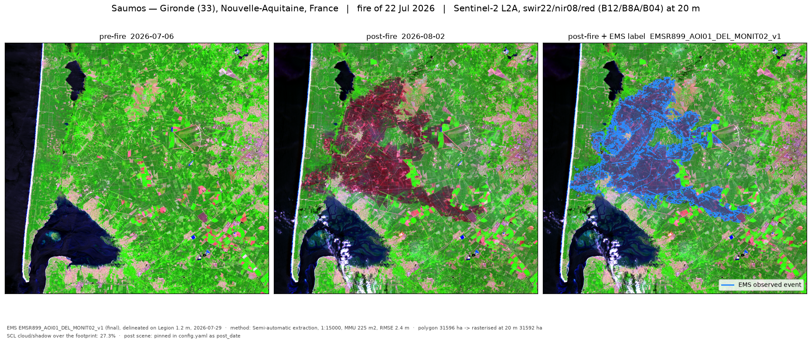
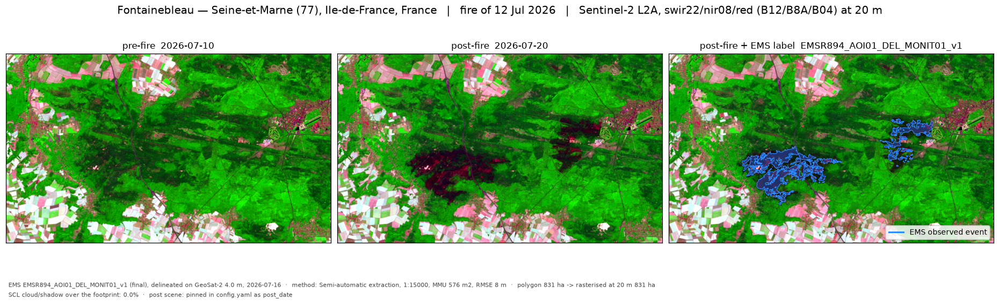

# burned-area-s2

Burned-area segmentation from Sentinel-2 pre/post pairs: a U-Net compared
against a thresholded dNBR baseline, on three Copernicus EMS fires from the
2026 French season.

The aim is to locate *where* a per-pixel index fails, and to see whether
spatial context fixes those specific failures. So both methods get a single
decision threshold, calibrated the same way on the same held-out pixels and
frozen before test, and the split is by event: train on Saumos (31 602 ha,
pine), test on Biscarrosse (1 753 ha, pine) and Fontainebleau (832 ha,
broadleaf). Comparing the two drops separates a size effect from a biome
effect.

**Status, 22 August 2026 — active development.** The data chain, the evaluation
machinery and the U-Net are built and have run. Every number below is real and
traceable to a script. Still to come: the few-shot adaptation curve (E3) and the
error maps that check the clearcut hypothesis stated further down.

## Results

The dNBR is not a straw man. It is what an agency actually runs, and the
comparison is set up so it can win: one threshold, calibrated by maximising F1
on calibration blocks held out inside the training event, frozen, and applied
unchanged to every test event. *Both methods have exactly one decision
parameter, calibrated by the same procedure on the same 772 271 pixels and
frozen before test* — dNBR at 0.576, the network at 0.885. The network
contributes a probability raster and nothing else; every cell below comes from
the same domain, metric and bootstrap code in `src/eval/`.

| Exp. | Event | Method | IoU | F1 | Precision | Recall | AP | Area error |
|---|---|---|---|---|---|---|---|---|
| E1 | saumos | **U-Net** | **0.863** | 0.927 | 0.939 | 0.915 | 0.976 | −2.5% |
| E1 | saumos | dNBR honest | 0.702 | 0.825 | 0.918 | 0.750 | 0.906 | −18.3% |
| E1 | saumos | dNBR oracle | 0.812 | 0.896 | 0.867 | 0.929 | 0.906 | +7.2% |
| E2 | biscarrosse | **U-Net** | **0.571** | 0.727 | 0.618 | 0.883 | 0.702 | +42.9% |
| E2 | biscarrosse | dNBR honest | 0.481 | 0.649 | 0.623 | 0.678 | 0.641 | +8.8% |
| E2 | biscarrosse | dNBR oracle | 0.526 | 0.689 | 0.574 | 0.861 | 0.641 | +49.9% |
| E2 | fontainebleau | **U-Net** | 0.556 | 0.715 | 0.839 | 0.623 | 0.830 | −25.7% |
| E2 | fontainebleau | dNBR honest | 0.192 | 0.323 | 0.966 | 0.194 | 0.839 | −80.0% |
| E2 | fontainebleau | dNBR oracle | **0.624** | 0.768 | 0.708 | 0.841 | 0.839 | +18.8% |

Full table, confusion matrices and provenance:
[`outputs/results.md`](outputs/results.md).

**The oracle row is the instrument the whole comparison turns on.** It refits
the index's threshold on the test event itself — impossible in production, since
it needs the answer to produce the answer. It is the upper bound of what the
index can do at any threshold, so it splits the network's lead in two: the part
a cheap local recalibration would also have bought, and the part that is
genuinely information a per-pixel index does not contain.

Read that way, the three events do not tell one story. They tell two, and the
split falls exactly on the biome boundary.

**On pine, the network wins on information, not on calibration.** It beats the
oracle on Saumos (0.863 vs 0.812) and on Biscarrosse (0.571 vs 0.526). No
threshold on the index reaches those numbers, so the gain is not a calibration
artefact — it is context the index cannot hold at any operating point. That the
size control behaves like the training event says the effect survives a 1:23
change of scale.

**On broadleaf, the network loses to a recalibrated index.** Fontainebleau is
where the honest baseline collapses — IoU 0.192, precision 0.966, recall 0.194,
80% of the area missed — and where the network looks most impressive by
comparison, 0.556 against 0.192. That comparison is the misleading one. The
oracle reaches 0.624. **The network's entire lead over the honest baseline on
the unseen biome is calibration transfer, and a local recalibration of the dNBR
would have bought more of it, for the price of one threshold.** Threshold-free
average precision says the same thing from the other side: 0.839 for the index
against 0.830 for the network. On a biome it never saw, the network carries
marginally *less* separable signal than the index it was supposed to replace.

The operational reading is the one worth stating plainly: on this evidence,
deploying this network to a new biome is not justified, and recalibrating the
index there is. That is the answer to the question in the first paragraph, and
it is not the answer the project was set up hoping for.



The epoch was chosen on the calibration blocks by average precision, which is
threshold-free, so the choice of epoch and the choice of threshold stay
separate. Those blocks do double duty — model selection and threshold — so the
F1 the threshold reports there is mildly optimistic about itself. Neither use
touches a test pixel.

**The hypothesis written down before the network existed**, so that checking it
means something: the Landes de Gascogne is a production pine forest riddled with
clearcuts whose NBR drop closely resembles a burn scar. A per-pixel threshold
cannot separate them; a network with a wide receptive field should, because
clearcuts are rectangular, aligned on the cadastre and sharp-edged. That is the
mechanism by which a CNN was expected to beat the index, and Biscarrosse — where
the honest index calls burned an area it gets right only 62% of the time — is
where it should show up. The pine results are consistent with it. *Consistent
with* is not *verified*: the error maps that would actually confirm the
mechanism are task T4.3 and are not done, so the mechanism remains a hypothesis
the numbers have not yet contradicted.

## How the evaluation is set up



**Split by event, and by spatial block inside the training event.** Blocks are
~17.5 km, beyond the autocorrelation range of a scar this size. Roles are
separated by a 1 km buffer belonging to nobody — a compromise, not a guarantee,
since 2 km is inside the range the blocks exist to respect. Full separation was
tried: it left 30 ha of burned ground in the calibration blocks out of 1 442,
nothing to calibrate on. Stated rather than solved.

**The test footprint is geometric** — EMS area of interest plus a 2 km buffer —
and every pixel inside it is scored, including entirely unburned ones. Nothing
is filtered for being negative; filtering would inflate precision by an
arbitrary factor and make the number comparable to nothing.

**One validity mask, both methods.** A pixel counts only if the Scene
Classification Layer calls it usable on both dates. The Saumos post-fire scene
is 27% clouded — it is still the best available, the alternative is 75% — and
that costs 8 293 ha of the scar. Those pixels are dropped for the index and for
the network identically, and the tests assert that the two methods are scored on
the same pixel count and the same label area, event by event.

**No confidence intervals are published, and that is a result.** The bootstrap
resamples spatial blocks, and it counts blocks that actually contain burned
pixels, because every metric here is a statement about burned area. Both
transfer events fit inside a single block. The training event has four held-out
blocks, but 94% of their burned area sits in one of them. So no evaluation
domain in this project supports an interval, every point estimate stands alone,
and each missing interval carries its reason in
[`outputs/results.json`](outputs/results.json). A declared hole beats a false
interval, and it applies to the network exactly as it does to the index.

**The circularity floor is reported before anyone asks.** All three EMS
delineations are semi-automatic extractions, so part of any "learned method
beats the index" result is the index agreeing with how the label was drawn.
Threshold-free average precision of the raw dNBR against each label: 0.91, 0.64,
0.84. Fontainebleau's 0.84 is the one to keep in mind: the index separates that
label well, and only its threshold fails to transfer.

**Never global accuracy.** It sits near 98% under this imbalance whatever the
method does; `config.yaml` forbids it and the metrics module refuses to emit
it.

## Running it

```bash
conda env create -f environment.yml
conda activate burned-area-s2

python -m src.config                              # events and settings, as loaded
python -m src.data.ems                            # EMS label provenance
python -m src.data.stac --event saumos --list     # candidate scenes + cloud
python -m src.data.stack                          # 8-channel stacks + validity masks
python -m src.eval.blocks                         # spatial blocks and their roles
python -m src.eval.dnbr                           # the baseline score rasters
python -m src.eval.baseline                       # calibrate, evaluate, write the table

python -m src.data.tiles                          # tile inventory, both regimes
python -m src.model.dataset                       # train-only normalisation stats
python -m src.model.train --experiment E1         # ~10 min on 16 CPU threads
python -m src.model.predict --experiment E1       # one probability raster per event
python -m src.model.evaluate                      # both methods, one table

python -m src.viz.quicklook --event saumos        # before / after / label
python -m src.viz.evaluation                      # PR curves and the split map
python -m src.viz.training --experiment E1        # loss and model-selection curves
pytest -q
```

No GPU. The whole chain runs on CPU: 40 epochs of a 24.5 M-parameter U-Net over
70 tiles takes about ten minutes.

No credentials needed. The imagery is public COGs from the Element 84 STAC
catalogue.

## Layout

```
config.yaml     events, experiments, evaluation settings. No event name,
                EMS code or date lives anywhere else.
src/data/       STAC access, EMS labels, target grids, stacks and validity
src/model/      tiles as tensors, U-Net, training loop, inference, scoring
src/eval/       dNBR, thresholds, metrics, blocks, bootstrap, the results table
src/viz/        figures
outputs/        versioned figures, tables and frozen thresholds, never rasters
tests/          guards on the evaluation setup
```

The tests exist because a leak produces a plausible number rather than a
crash, and that's the harder failure to catch: a test event can't appear in
training, the threshold can't be calibrated on a test event, an interval can't
be published over a domain that cannot support one, and accuracy can't reach a
table. Two settings are guarded ahead of the code that will read them: test
tiles can't be given an overlap, negative test tiles can't be filtered out.
Phase 3 adds the ones that guard the network: a training tile can't touch
calibration ground, normalisation statistics can't come from a test event, a
clouded pixel can't contribute a gradient, the two methods can't be scored on
domains that merely resemble each other, and the network can't have an oracle
row of its own.

## Data





False colour B12/B8A/B04 at 20 m — three of the four bands the model sees.
Scars read dark maroon.

Four bands × two dates = eight channels, at 20 m. The decisive argument for 20 m
rather than 10 m is not compute: the EMS polygons are digitised at 1:15 000, and
a per-pixel score at 10 m would mostly measure the analyst's hand.

**A correction, recorded rather than quietly applied.** The first baseline
numbers published here were computed on reflectance that had the Sentinel-2
baseline-04.00 band offset applied twice — once by the provider, once again by
this code, because the COGs carry the offset in their metadata while already
being harmonised. It put 90% of red-band and 71% of B12 pixels at negative
reflectance and pushed NBR outside ±1 for roughly half the scene, where a
normalised difference stops being monotonic in what it measures. It crippled the
index while leaving the network untouched, since per-channel standardisation
absorbs an additive shift — the exact shape of an unfair comparison. It was
found while checking the network's inputs, fixed in `src/data/stack.py`, and the
whole chain was re-run; the dNBR is considerably stronger since (Saumos IoU
0.521 → 0.702). A guard now refuses any band whose valid pixels are more than
10% negative, so a recurrence fails loudly instead of producing a plausible
table.

## Licence

MIT. Copernicus EMS products and Sentinel-2 data under their respective terms.
